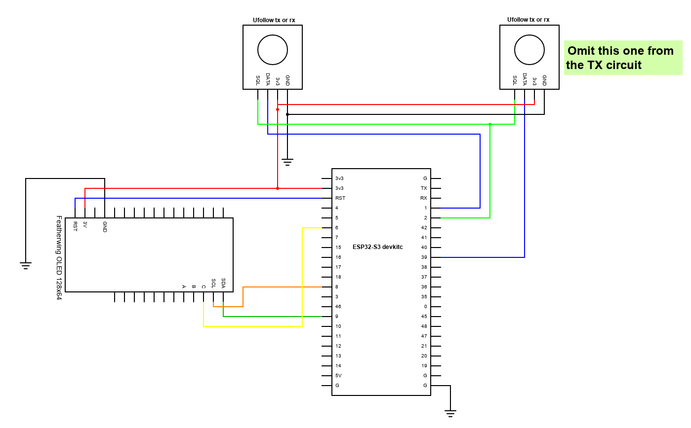

Prototype receiver and transmitter:

Transmitter firmware Todo list:
- [ ] Refactor to align with receiver code structure
- [x] JSON storage for settings
- [x] Automatic pairing with receiver (initiated by receiver)
- [ ] Add webserver, wifi access point
- [ ] Create a configuration page
- [ ] Implement the LED
- [ ] Remove the display or make it optional (use the qwiic connector)
- [ ] Get rid of all the serial.print commands everwhere
- [ ] Enable/disable, to stop the receiver from outputting

Receiver firmware todo list:
- [x] Add webserver, wifi access point
- [x] JSON storage for settings
- [x] Automatic pairing - one button
- [ ] Create a configuration page
- [ ] Make the LED do more interesting stuff
- [ ] Remove the display or make it optional (use the qwiic connector)
- [ ] Get rid of all the serial.print commands everwhere
- [ ] Outputs: UART, PWM, I2C, SPI, etc?
- [ ] Enable/Disable from transmitter
- [ ] Improve the averaging/smoothing.  Throw out bogus values
- [ ] Handle signal loss or line of sight issues
- [ ] Measure the jitter in ESP-NOW timing

Hardware wish list:
- [x] Next revision of receiver board
- [ ] Receiver mcu board: clearly mark TX and RX as IN or OUT
- [ ] Receiver mcu board: SCL and SDA are swapped
- [ ] Receiver mcu board: replace the diode with a mosfet
- [ ] Power supply for transmitter suitable for battery operation
- [ ] Try out switching between multiple tx transcievers for better angle tolerance
- [ ] Figure out which pins to expose

There are two main layers - RF and Ultrasonic.  The RF layer is wifi, using the ESP-NOW protocol.  The transmitting device sends a packet and the receiving one receives it (duh).

We are using the ESP32-S3 devkit board: https://docs.espressif.com/projects/esp-idf/en/latest/esp32s3/hw-reference/esp32s3/user-guide-devkitc-1.html
and this adafruit OLED display: https://www.adafruit.com/product/4650

For now the circuits are identical, only the code is different.

RMT peripheral documentation (for generating waveforms/pulse sequences)
https://docs.espressif.com/projects/esp-idf/en/latest/esp32s3/api-reference/peripherals/rmt.html

For the revision 1 receiver:
- The squelch pin mutes the data output while it is high
- The data pin is normally low, transitions to high when a ping is received
- The squelch pin also resets the one-shot circuit, so:
1. Keep the squelch pin high normally
2. When a wifi packet is received, set that pin to low
3. When the data pin goes high (interrupt pin), log that timestamp and reset the squelch pin to high again
4. if too much time passes without the data pin changing, set the squelch high and wait for the next packet
5. Repeat forever

Component notes:
ESP32-S3 (this is the lowest model): https://www.lcsc.com/product-detail/WiFi-Modules_Espressif-Systems-ESP32-S3-WROOM-1-N4_C2913197.html

USB-UART CH340c: https://www.lcsc.com/product-detail/USB-ICs_WCH-Jiangsu-Qin-Heng-CH340C_C84681.html

DC-DC Module: https://www.lcsc.com/product-detail/Power-Modules_DEXU-Electronics-K7803M-1000R3_C2916516.html

almost 12 inch cable with JST XH connector: https://www.lcsc.com/product-detail/Dupont-Cable-Terminal-Block-Cable-Electronic-Cable_DEALON-LNN254-100724-300-4P_C5160861.html

Same cable but double ended: https://www.lcsc.com/product-detail/Dupont-Cable-Terminal-Block-Cable-Electronic-Cable_DEALON-LDS254-100724-300-4P_C5160865.html

XH vertical board connector:
- white: https://www.lcsc.com/product-detail/Wire-To-Board-Wire-To-Wire-Connector_HCTL-XH-4A_C2908602.html
- black: https://www.lcsc.com/product-detail/Wire-To-Board-Wire-To-Wire-Connector_HCTL-XH-4A-B_C2979570.html
- red: https://www.lcsc.com/product-detail/Wire-To-Board-Wire-To-Wire-Connector_HCTL-XH-4A-R_C2979568.html
- blue: https://www.lcsc.com/product-detail/Wire-To-Board-Wire-To-Wire-Connector_HCTL-XH-4A-L_C2979569.html

XH horizontal board connector: https://www.lcsc.com/product-detail/Wire-To-Board-Wire-To-Wire-Connector_BOOMELE-Boom-Precision-Elec-XH-4AW_C21273.html

Qwiic
- Real JST: https://www.lcsc.com/product-detail/Wire-To-Board-Wire-To-Wire-Connector_JST-Sales-America-BM04B-SRSS-TB-LF-SN_C160390.html
- Cheap clone: https://www.lcsc.com/product-detail/Wire-To-Board-Wire-To-Wire-Connector_JUSHUO-AFC10-S04QCA-00_C2764183.html